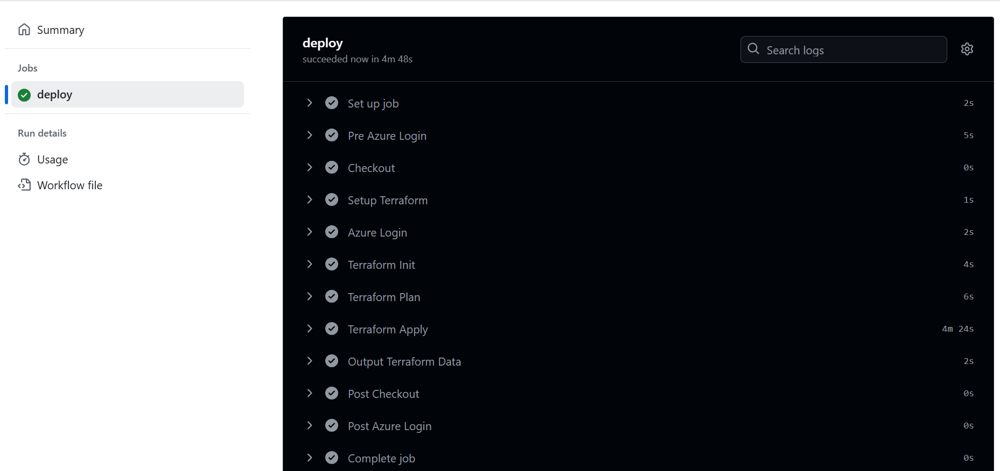
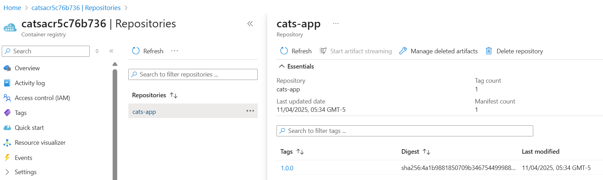
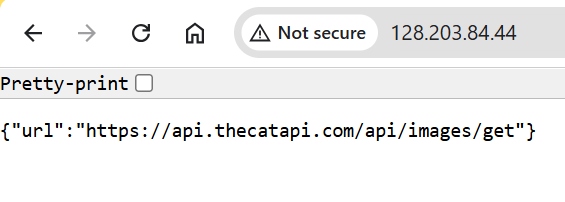
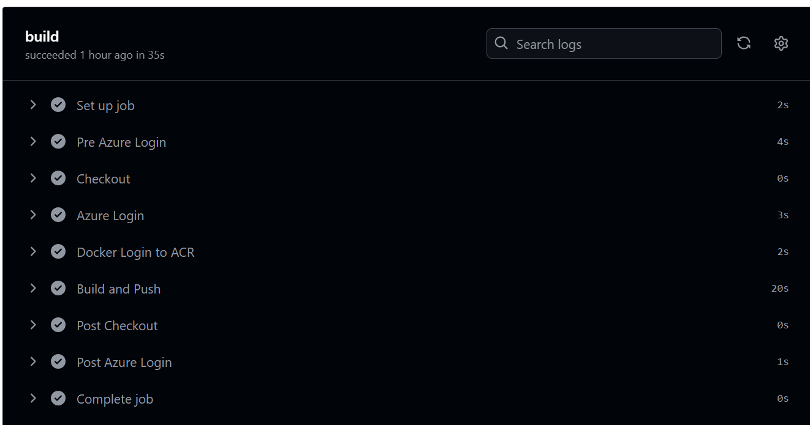
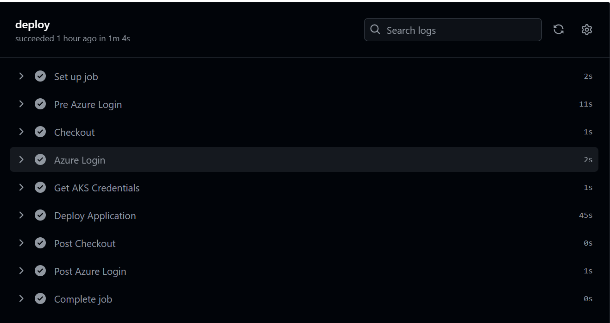

# 🐱 Cats Web App — Containerized Sinatra App on AKS

A minimal [Sinatra](http://sinatrarb.com/) web app that returns a URL for a random cat picture on the `/` endpoint. Built for fun, deployed with modern DevOps practices.

---

## 🧭 Project Overview

This project demonstrates an end-to-end deployment using:

- **Azure Kubernetes Service (AKS)** for container orchestration
- **Azure Container Registry (ACR)** to store Docker images
- **Terraform** for infrastructure provisioning
- **GitHub Actions** for CI/CD pipeline automation

✅ Designed for **zero downtime** with health checks, autoscaling, and rolling updates.

---

## 💡 Enhancements

### 🩺 `/health` Endpoint

Added a new route in `lib/cats.rb`:

```ruby
get '/health' do
  content_type :json
  {
    status: 'healthy',
    version: ENV['APP_VERSION'] || '1.0.0'
  }.to_json
end
```

📌 Used by Kubernetes for:

- **Readiness Probe** — Checks if the app is ready to receive traffic
- **Liveness Probe** — Ensures the app is running properly

---

## ☁️ Azure Infrastructure with Terraform

Terraform files live in the `/Infrastructure` folder.

### 🔧 Provisioned Resources

| Resource                | Details |
|-------------------------|---------|
| Resource Group          | `cats-app-rg` |
| ACR                     | `catsacr<hash>` |
| AKS Cluster             | `cats-aks` with auto-scaling |
| Load Balancer           | Standard Public |
| Role Assignment         | AKS pull access to ACR |

---

## 🔁 CI/CD with GitHub Actions

### 🛠 Prerequisites

#### 1. Create Azure Service Principal

```bash
az ad sp create-for-rbac   --name "CatsAppDeploy"   --role contributor   --scopes /subscriptions/<subscription-id>   --sdk-auth
```

#### 2. Assign Additional Roles

```bash
az role assignment create --assignee <client-id> --role "Contributor" --scope /subscriptions/<subscription-id>
az role assignment create --assignee <client-id> --role "User Access Administrator" --scope /subscriptions/<subscription-id>
```

#### 3. Store GitHub Secret

- Name: `AZURE_CREDENTIALS`
- Value: Output from `az ad sp create-for-rbac`

---

## ⚙️ GitHub Actions Workflows

### 📄 `infra-deploy.yml`

Automates:

- Terraform init → plan → apply
- AKS provisioning with minimal manual steps
A snapshot of the deployment workflow in action:



### 📄 `app-deploy.yml`

Automates:

- Docker build and push to ACR
- Rolling update to AKS

---

## 🐳 Dockerization

Based on `ruby:2.7-alpine`. Local test:

```bash
docker build -t cats-app .
docker run -p 8000:8000 cats-app
# Access: http://localhost:8000
```

---

## ☸️ Kubernetes Manifests (`/manifests`)

| File              | Purpose |
|-------------------|---------|
| `namespace.yaml`  | Creates `cats-prod` namespace |
| `deployment.yaml` | Deploys app with rolling updates |
| `service.yaml`    | Public LoadBalancer service |
| `hpa.yaml`        | CPU-based autoscaler |

### 🩺 Health Check

Configured `readinessProbe` using `/health` endpoint.

---

## 🚀 Manual Deployment (v1.0.0)

```bash
# Set variables
export ACR_NAME=$(terraform output -raw acr_name)

# Build & Push
docker build -t $ACR_NAME.azurecr.io/cats-app:1.0.0 .
az acr login --name $ACR_NAME
docker push $ACR_NAME.azurecr.io/cats-app:1.0.0

# AKS Login
az aks get-credentials   --resource-group $(terraform output -raw resource_group_name)   --name $(terraform output -raw aks_name)

# Apply manifests
kubectl apply -f manifests/namespace.yaml
sed -i "s/\$ACR_NAME/$ACR_NAME/g" manifests/deployment.yaml
sed -i "s/\$TAG/1.0.0/g" manifests/deployment.yaml
kubectl apply -f manifests/

The screenshot below shows the image on Azure Container registry

```

📍 App will be accessible via LoadBalancer IP (e.g. `http://128.203.84.44/`)



---

## 🔁 CI/CD for v2.0.1

```bash
git commit -am "Prepare v2.0.1 release"
git tag v2.0.1
git push origin v2.0.1
```

Pipeline auto-triggers:

- Build & push Docker image
- Deploy to AKS with zero downtime

Screenshot of successful build on Github actions


Screenshot of success deploy to ACR


---

## 🧪 Local Testing

```bash
bundle install
bundle exec puma -C config/puma.rb
# Visit http://localhost:8000
```

---

## 🔄 Zero Downtime Strategy

- **Rolling Updates** — ensures no pod goes down
- **Readiness Probe** — verifies app is ready
- **Autoscaling** — adjusts replicas based on CPU
- **Load Balancer** — evenly routes traffic

---

## ⚙️ ENV Configuration

| Variable        | Default     | Description |
|----------------|-------------|-------------|
| `RACK_ENV`     | production  | Sinatra env |
| `PORT`         | 8000        | App port |
| `WEB_CONCURRENCY` | 1        | Puma workers |
| `MAX_THREADS`  | 1           | Puma threads |

---

## ✅ Stack Review

| Tool            | Pros                                           | Cons |
|-----------------|------------------------------------------------|------|
| Terraform       | Declarative, reusable, stateful                | Steeper learning curve |
| AKS             | Fully managed, autoscaling, secure             | Overkill for small apps |
| ACR             | Secure & native integration with AKS           | Extra cost |
| GitHub Actions  | Built-in CI/CD, secret management              | Debugging complexity |
| Docker          | Lightweight, consistent, dev-friendly          | Can grow large without pruning |

---

## 📂 Project Structure

```
.
├── Infrastructure/       # Terraform scripts
├── manifests/            # Kubernetes YAMLs
├── .github/workflows/    # CI/CD pipelines
├── lib/cats.rb           # Sinatra app logic
├── Dockerfile            # App container setup
├── config.ru             # Rack config
├── config/puma.rb        # Puma web server settings
└── README.md             # You're here!
```

---

## 📋 Requirements

- [Terraform](https://developer.hashicorp.com/terraform)
- [Azure CLI](https://learn.microsoft.com/en-us/cli/azure/install-azure-cli)
- [kubectl](https://kubernetes.io/docs/tasks/tools/)
- [Docker](https://www.docker.com/)
- Azure Subscription

---

🐾 Made with love for cats.